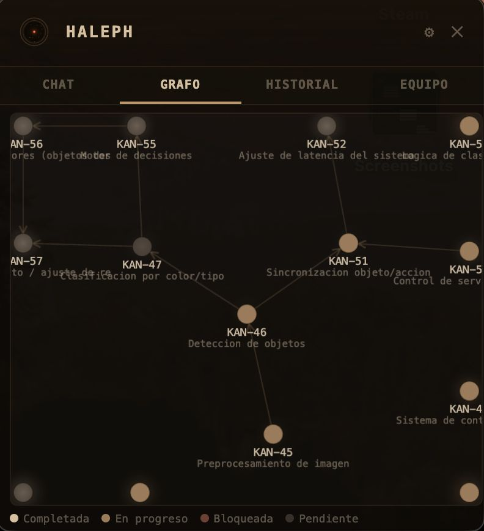
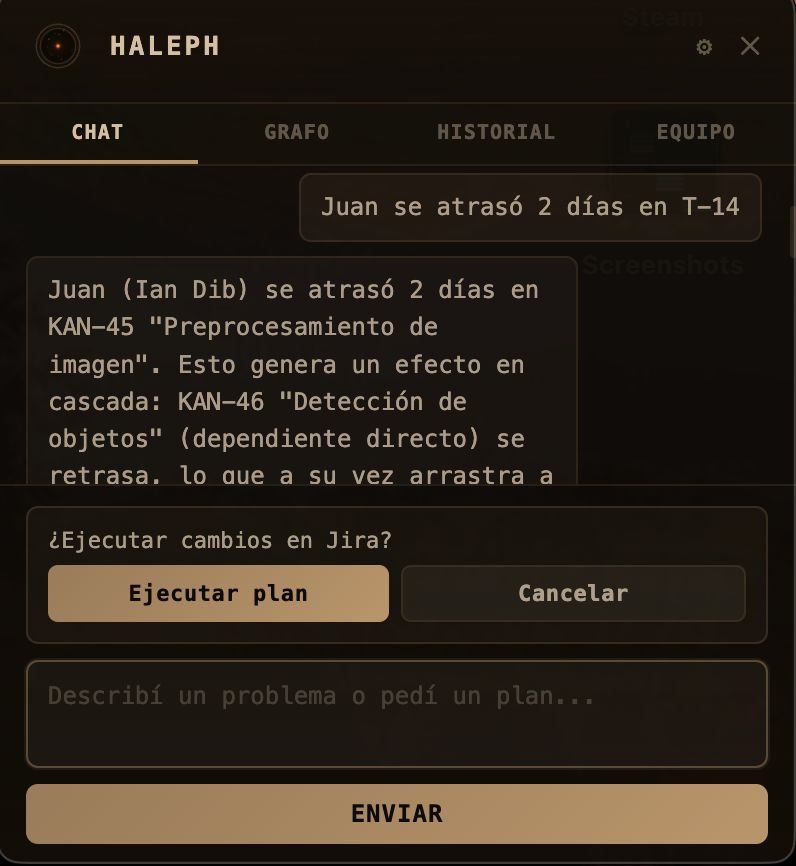

# Haleph




## Ejecución

Para ejecutar una demostración se necesta tener Python instalado. En Linux viene instalado por defecto, para Windows instalarlo aquí en caso de no tenerlo: [https://apps.microsoft.com/detail/9nq7512cxl7t?hl=en-US&gl=AR]

Abrir una terminal y correr el siguiente comando:

```bash
python3 demo.py
```

o, si esto no funciona

```bash
python demo.py
```

Este comando abrirá tres aplicaciones: Jira y Google Calendar en el buscador por una parte, y la overlay de Haleph por otra. Ustedes podrán crear tareas en Jira y eventos en Google Calendar. Cuando lo hagan verán que las aplicaciones se sincronizan entre sí automáticamente. Además, en la overlay podrán chatear con Halef, y comunicarle en lenguaje natural distintos eventos que pudieran suceder, como por ejemplo "Juan se atrasó 2 días en X tarea". Podrán ver un grafo con todas las tareas y sus dependencias, un historial de los ajustes que se realizaron y un panel con la vista del equipo de personas que integra el proyecto.

A medida que vaya utilize el programa se dará cuenta que no es capaz meramente de sincronizar tareas, sino de adaptar workflows enteros a cambios inesperados y planificar proyectos desde cero, tomando en cuenta el historial de interacciones y conocimiento sobre los miembros del equipo, para distribuir el trabajo de forma equitativa y eficiente. Logra esto gracias a nuestro approach múltiple, que une algoritmos tradicionales con modelos de lenguaje para conseguir robustez y flexibilidad al mismo tiempo.


